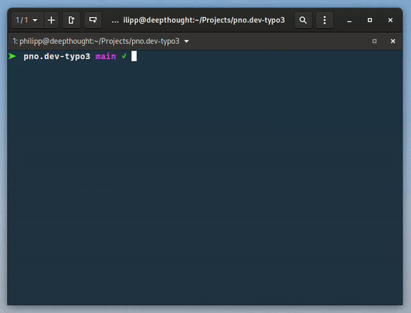

# jim

jim is a highly extensible task runner.



## Concept

jim comes in two parts: the cli-command and the `jim-core` package.

### jim-cli

The jim command is just a wrapper that makes the `jim` command globally available. When you run a jim command, it will look for a jim-runtime inside the current working directory and delegate the command to it.

### jim-core (this package)

The jim-runtime can be installed via [Composer](https://getcomposer.org/) or [npm](http://npmjs.com/). Once you installed the package inside your project, you will be able to execute jim commands.

#### jim-core and jim-scripts

The jim-core packages comes with a pretty small set of pre-installed commands. The true power of jim lies in the concept of jim-scripts.

You can write your own commands as node- or shell-scripts and make them available to jim.
## Installation

### jim-cli

You can install the jim-command by executing the `install.sh` script inside the repository. You only need to do this once.

### jim-core

Depending on your project, you can install jim-core with the following commands:

> **Note**
> It is recommended to install jim-core as a dev-dependency

#### Node / npm

```bash
npm install -D @pnodev/jim-core
```

#### PHP / Composer

```bash
composer require --dev pnodev/jim-core
```

## Configuration / Usage

You can provide project-specific configuration with a `.jimrc` file:

```bash
NODE_VERSION=20
DIR_JIM_SCRIPTS=./jim-scripts
```
| Variable          | Description                                                                                                                                                                                                                                                     |
|:------------------|:----------------------------------------------------------------------------------------------------------------------------------------------------------------------------------------------------------------------------------------------------------------|
| `NODE_VERSION`    | if you set the node-version, jim will make sure to set the correct version via [nvm](https://github.com/nvm-sh/nvm) before executing node commands. This is especially useful if you are switching a lot between projects that require different node versions. |
| `DIR_JIM_SCRIPTS` | Makes node- or shell-scripts at the specified location available as jim-commands.                                                                                                                                                                               |

You can add more project-specific variables here. All variables defined in `.jimrc` will be exposed to the commands,
so you can use them in your scripts. You could e.g. add variables to define the path to your JavaScript files and
use it inside a esbuild-task.

## Writing custom commands

Custom commands can be written as shell scripts. The jim-runtime provides you with the following helpers for writing your scripts in a consistent manner:

### Environment Variables

The following environment variables will be made available for your commands:

| Variable          | Description                         |
|:------------------|:------------------------------------|
| `DIR_JIM_SCRIPTS` | The path to your jim-scripts folder |
| `DIR_CORE`        | The path to your jim-core package   |

> **Note**
> Additionally, all variables you defined in `.jimrc` will be available as well.

### Utility functions

By importing the following script, you get access to a bunch of utility functions:

```bash
source "${DIR_CORE}/utils.sh"
```

#### Colors

To generate more pleasing terminal output, you can use the following variables to format your logs:

| Variable       | Description              |
|:---------------|:-------------------------|
| `COLOR_RESET`  | Resets all formatting    |
| `COLOR_YELLOW` | Sets the color to yellow |
| `COLOR_BLUE`   | Sets the color to blue   |
| `COLOR_GREEN`  | Sets the color to green  |
| `COLOR_RED`    | Sets the color to red    |
| `COLOR_CYAN`   | Sets the color to cyan   |
| `COLOR_DIMMED` | Dimms the output color   |
| `COLOR_BOLD`   | Formats the output bold  |

#### _log

The `_log` function provides a coherent output behaviour. It is recommended to use it for all logs. It accepts the output string as the first parameter and an optional second parameter to set the output color.

```bash
_log "This is a yellow string" "${COLOR_YELLOW}"
```

#### _ask

The `_ask` functions displays a prompt to which the user can answer with yes or no. A good usecase for this function is asking the user for confirmation before executing a potentially dangerous command:

```bash
source "${DIR_CORE}/utils.sh"

if _ask "This will overwrite the data on the deploy server, do you want to continue?"
then
  _log "… Stating update" "$COLOR_YELLOW"
  ddev updateDeploy
  _log "✓ update finished" "$COLOR_YELLOW"
  echo ""
fi
```

#### _box

The `_box` function will display a given string inside a box:

```bash
_box "I'm in a box"
```

```
┌──────────────┐
│ I'm in a box │
└──────────────┘
```

#### _invoke

The `_invoke` command can be used to start another jim-task as a subtask. E.g. if you have a `build`-task that should
start both the `build:css`- and `build:js`-tasks, you could do the following:

```bash
source "${DIR_CORE}/utils.sh"

setNodeVersion

_invoke build:css
_invoke build:js
```

#### _announceTaskStart

Pre-formatted log for announcing that your task started.

```bash
_announceTaskStart "Building CSS"
```

```
[jim] 🚧 Building CSS
```

#### _announceTaskEnd

Pre-formatted log for announcing that your task finished.

```bash
_announceTaskEnd "CSS built in ${PATH_CSS_OUT}"
```

```
[jim] 💪 CSS built in Resources/Public/Css/main.min.css
```

#### setNodeVersion

Sets the node version to the one specified in `.jimrc`. This is useful if you need to call a node-script from inside a shell-script command.

```bash
source "${DIR_CORE}/utils.sh"

setNodeVersion
npm install
```

## Removing jim-cli

If you want to remove the jim command from your system, simply execute the `uninstall.sh` script inside this repository.
## License

[MIT](https://choosealicense.com/licenses/mit/)

